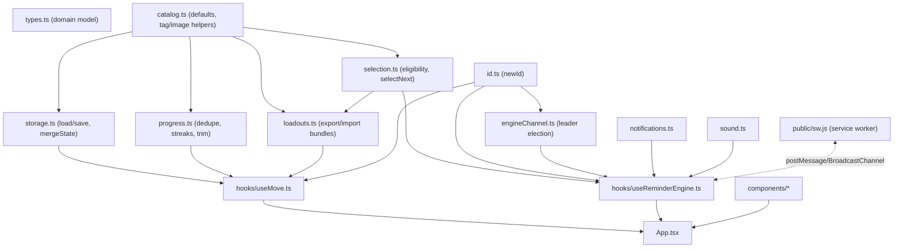
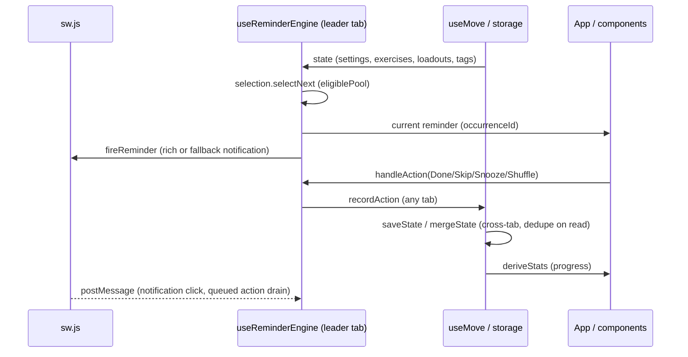

# Architecture — Move

Move is a no-backend, installable PWA (Vite + React 19 + TypeScript + Tailwind v4). All state lives
in `localStorage`; there is no server. The app fires periodic exercise reminders through a
Clippy-style assistant, chosen from a tag-driven catalog filtered by a user-editable loadout.

## Module map

## Domain model (`src/types.ts`)

- `TagAxis` — `'equipment' | 'context' | 'type' | 'intensity' | 'duration' | 'other'`.
- `TagDef` — `{ name, axis, updatedAt }`, the registry entry for every tag in the system.
- `Exercise` — `{ id, name, instructions, target, image, tags: string[], custom, updatedAt }`.
  `target` is `{ kind: 'reps', reps }` or `{ kind: 'time', seconds }`.
- `Loadout` — `{ id, name, include, requireAll, exclude, updatedAt }`, tag-name rule arrays.
- `HistoryEntry` — `{ id, occurrenceId, exerciseId, action, at }`, one recorded reminder outcome.
- `Rollup` — `{ done, ignored, doneDayKeys, trimmedThroughAt }`, the folded summary of trimmed history.
- `Settings` — `{ intervalMinutes, snoozeMinutes, activeContext, ownedEquipment, activeLoadoutId, updatedAt }`.
- `MoveState` — `{ settings, exercises, loadouts, history, rollup, tags }`, the entire persisted app state.
- `LoadoutBundle` — `{ version: 1, loadout, exercises, tags }`, the self-contained export/import format.
- `ImportResult` — `{ state, warnings }`, returned by `importBundle`.

Every mutable entity (`Exercise`, `Loadout`, `TagDef`, `Settings`) carries `updatedAt`, which
`storage.ts` uses to resolve cross-tab conflicts.

## Pure logic modules

- **`src/id.ts`** — `newId()`: `crypto.randomUUID()`, else a UUID built from `crypto.getRandomValues`,
  else a `timestamp+counter` string. Never throws, even outside a secure context.
- **`src/catalog.ts`** — the built-in exercise catalog, seeded tags, `createDefaultState()`, and
  shared helpers: `normalizeTag` (trim + lowercase), `axisOf`, `formatTarget`, `localDayKey`
  (local-calendar-day, DST-safe), `isSafeImage` (raster-only `data:` allowlist — blocks all SVG),
  `resolveActiveLoadout` (falls back to the default loadout when `activeLoadoutId` is dangling),
  `pruneDoneDayKeys`, and the tuning constants `MAX_DELAY_MS`, `HISTORY_CAP`, `DEDUPE_WINDOW_MS`,
  `MAX_BUNDLE_BYTES`, `MAX_IMAGE_BYTES`.
- **`src/selection.ts`** — `matchesLoadout` (include/requireAll/exclude against an exercise's tags),
  `isEligible` (adds active-context and owned-equipment constraints), `eligiblePool(state)` (the
  exercises currently selectable), `selectNext(pool, lastId?)` (random pick avoiding immediate
  repeat).
- **`src/storage.ts`** — `loadState()`/`saveState()` against `localStorage` key `move.state`, with
  per-field type guards so corrupt/partial data falls back to defaults (built-ins are always
  re-merged in). `serialize(state)` produces a canonical, key-sorted, array-sorted string.
  `mergeState(a, b)` is a **commutative, idempotent** merge: each entity is resolved by the greater
  `updatedAt`, ties broken by the lexicographically smaller canonical form, so
  `mergeState(a, b)` and `mergeState(b, a)` are byte-identical. History is unioned by entry `id` and
  any entry with `at <= rollup.trimmedThroughAt` is dropped; `rollup` keeps the greater
  `trimmedThroughAt`. `saveState` skips the write when the serialized form matches the last write.
- **`src/loadouts.ts`** — `exportBundle(state, loadoutId)` embeds every custom exercise that passes
  the loadout's rules plus every `TagDef` referenced by those exercises or the loadout's rule
  arrays. `importBundle(state, raw, opts?)` validates bundle version, total size (`MAX_BUNDLE_BYTES`),
  per-image size (`MAX_IMAGE_BYTES`) and safety (`isSafeImage`), and referential completeness (every
  tag name referenced by an imported exercise or the loadout must resolve to a `TagDef`, else it's a
  hard error). Exercises merge by id (identical → skipped, colliding-but-different → minted a fresh
  id since nothing else references exercise ids); the loadout is appended (fresh id on collision);
  tags merge by normalized name, with an axis conflict resolved by `opts.axisConflicts` as either
  "keep local axis" (returns a warning) or "rename" (mints a fresh tag name and rewrites the incoming
  exercises' tags and the loadout's rule arrays).
- **`src/progress.ts`** — `dedupeHistory(entries)` collapses entries sharing `(occurrenceId, action)`,
  then collapses `(exerciseId, action)` entries that fall within `DEDUPE_WINDOW_MS` of each other
  (guards against a split-brain double-fire). `deriveStats(rollup, history)` returns done/ignored
  counts, the current day streak, the citation-backed "sitting breaks" figure, and a labelled
  `estActiveMinutes` estimate. `trimHistory(state)` (leader-only) folds overflow past `HISTORY_CAP`
  into `rollup`, pruning `rollup.doneDayKeys` down to the contiguous run needed for the current streak.
- **`src/notifications.ts`** — `requestPermission()`, `maxInlineActions()` (feature-detects
  `Notification.maxActions`), `orderedActions(max)` (priority order Done, Snooze, Skip, Shuffle,
  truncated to the platform's slot count), `fireReminder(reg, exercise, occurrenceId)` — uses the
  service worker's rich `showNotification` (image + inline actions) when available, else falls back
  to a plain `Notification`.
- **`src/sound.ts`** — `playDing()` plays `public/ding.wav`, silently no-oping if `Audio` is
  unavailable or playback is blocked.
- **`src/engineChannel.ts`** — `createEngineChannel(handlers)` coordinates a single active reminder
  engine across tabs over `BroadcastChannel('move.engine')`. Tabs elect a leader by lowest
  `tabPriority` (a `newId()`); the leader heartbeats every 2s, a follower re-elects after 6s of
  silence or an explicit resign (sent on `pagehide`/hidden/`beforeunload`). Non-leader actions are
  relayed with an `actionEventId` and retried until acknowledged; the leader applies each id at most
  once. Armed snoozes are broadcast and adopted by a newly elected leader while still in the future.
  Falls back to a no-op shim (`isLeader()` always `true`) when `BroadcastChannel` is unavailable —
  each tab then runs its own engine independently.

## Hooks

- **`src/hooks/useMove.ts`** — the single state-owning hook. Holds `MoveState` via
  `useState(loadState)`; an effect calls `saveState` only when the serialized form actually changed;
  a `storage` event listener reloads, merges (`mergeState`), and updates React state only if the
  merged serialized form differs — preventing a save↔merge ping-pong between tabs. Exposes the
  mutators (`setIntervalMinutes`, `setSnooze`, `setContext`, `toggleEquipment`, `setActiveLoadout`,
  `addExercise`, `addTag`, `saveLoadout`, `importBundle`, `recordAction`, `trim`), each stamping
  `updatedAt`.
- **`src/hooks/useReminderEngine.ts`** — owns the *ephemeral* `running`/`current` reminder state
  (never persisted, so a reload always starts paused). Wires a `createEngineChannel` for leader
  election; only the leader schedules the interval tick and snooze re-fires (via `setTimeout`,
  clamped to `MAX_DELAY_MS`). On each tick it recomputes `eligiblePool`/`selectNext`; on an empty
  pool it skips the ding/notification but still reschedules the next tick. `handleAction` records
  the outcome (`recordAction`) from any tab, then either applies the transition directly (leader) or
  relays it over the channel (non-leader). Transitions are gated to the reminder whose
  `occurrenceId` matches `current`, so a stale notification can't dismiss an unrelated active one.
  Also drains any notification actions the service worker queued while no tab was open.

## Components (`src/components/`)

Named-function components with a local `XProps` type, composed by `App.tsx` inside `RetroWindow`:

- **`RetroWindow`** — the beveled window chrome + title bar.
- **`Assistant`** — the persistent Clippy-style character; renders `ReminderBubble` when a reminder
  is current, otherwise an idle/notice balloon.
- **`ReminderBubble`** — the yellow speech balloon: image, name, formatted target, instructions, and
  the Done/Skip/Snooze/Shuffle action buttons.
- **`SettingsPanel`** — Start/Stop control, interval/snooze inputs, context selector, equipment
  checklist.
- **`LoadoutLibrary`** — list/switch/create/edit loadouts, export/import (surfacing axis-conflict
  choices and size/completeness errors from `importBundle`).
- **`ExerciseCatalog`** — add-custom-exercise form (with axis-picker tag minting) and the catalog
  list, flagging which exercises are currently eligible.
- **`TagRuleEditor`** — include/require-all/exclude tag pickers for a loadout, with an always-visible
  axis picker when minting a new tag.
- **`ProgressPanel`** — done/ignored counts, current streak, the citation-backed sitting-breaks
  figure, and the labelled active-minutes estimate.

## `App.tsx` composition

`App` calls `useMove()` for state and `useReminderEngine()` for the ephemeral engine, adopts the
active `ServiceWorkerRegistration` (via `navigator.serviceWorker.ready`) for rich notifications, and
computes `eligiblePool`/`deriveStats` with `useMemo`. It renders `Assistant`, `SettingsPanel`,
`LoadoutLibrary`, `ExerciseCatalog`, `ProgressPanel`, and a live "Eligible now" list, all inside
`RetroWindow`.

## PWA infrastructure

- **`public/manifest.webmanifest`** — name "Move", `display: standalone`, theme colors, icons.
- **`public/sw.js`** (plain JS, outside `src/` so no WebWorker types leak into `tsconfig`) —
  versioned `CACHE_NAME`; `activate` deletes non-matching caches. Fetch strategy: network-first for
  navigations/HTML (cached fallback), cache-first for hashed `/assets/*`, stale-while-revalidate for
  other same-origin GETs. `notificationclick` closes the notification, then either posts a
  `reminder-action` message to an existing client (focusing it) or enqueues the action (Cache
  Storage) and opens a window; a `client-ready` message from the app flushes any queued action.
- **`src/main.tsx`** — registers `sw.js` and posts `client-ready` once the service worker is active.
- **`index.html`** — title "Move", manifest link, theme color.

## Data flow

